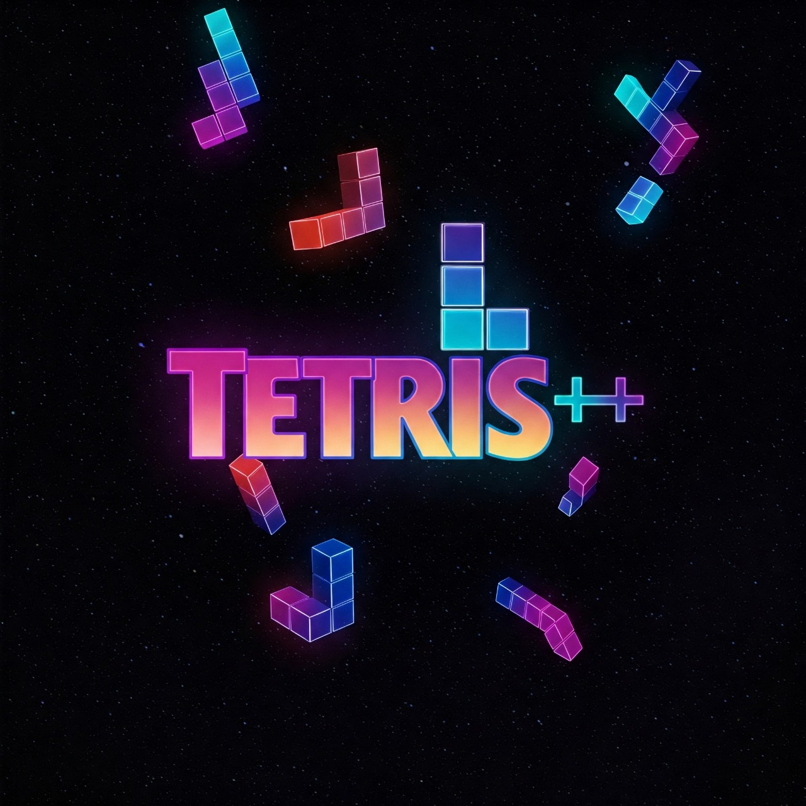
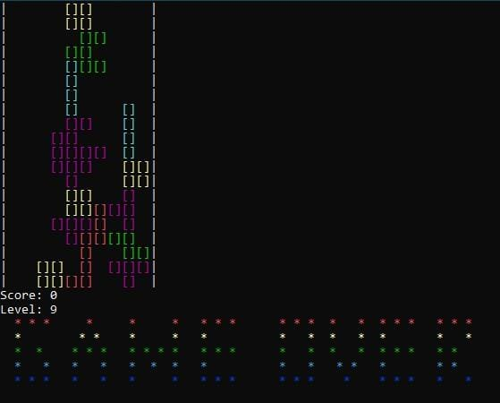

# Tetris++
Console based tetris game using C++, object oriented programming and data structures.

## Contents
-  [Installation](#installation)
- [Overview and features](#overview-and-features)
- [Demo](#demo)
- [Working and implementation](#working-and-implementation)

## Installation
You can download the executable (.exe file) and directly run it. Or compile and run the source code.
For compiling the source code (C++ (17 or later)) is required.
1. Clone the repository
```
git clone https://github.com/yugprajapati212/tetris
```
2. Compile the file
```
g++ tetris++.cpp -static -o ./tetris++
```
3. Run the game
```
tetris++
```

## Overview and features
### Mechanics
- All the seven standard tetromino included (I, O, T, S, Z, J, L).
- Gravity included due to which each tetromino falls at a certain speed that increases as the game goes on.
- Collision and line clearance is implemented so that games can be decisive of score proportional to number of lines cleared.
- Game is over when blocks reach the top.

### Controls
- The side arrow keys and 'A'/'D' are used for the movement of tetromino(←/'A' for left and →/'B' for right)
- ↑ Up arrow and 'W' key is used for rotating the falling peice 90 degrees.
- ↓ Down arrow/'S' key and spacebar keys are used for soft and hard drop respectively.
- Press ESC to pause or quit.

### Designing
Each block is represented by square brackets [], boundaries by |. Different colors for each tetromino blocks:
I - Cyan  
T - Magenta  
L - Blue  
J - Red  
O - Yellow  
S - Green  
Z - Bright Red 
Blink and bold methods are used for making the game look appealing.
## Demo
Here is a demo gameplay:
[](video1.mp4)


https://github.com/user-attachments/assets/bedc0fa2-b975-44b7-b7e9-7761ff1f5737


## Working and implementation
### Taking Input
To take input from the player we have used methods _getch() and _khbit(). Before updating the game state out to stdout khbit is used to check if a key is pressed and make changes according to the player input.

### Flow of the game
At each state the game runs in a loop and changes are to the output according to player input. We have devised methods to check for conditions such as if there is a block collision, peice merging and line clearance.
Like for collision checking: isValidMove(), peice merging: mergePeice(), etc.

### Data structures used
1. Grid is implemented by a 2D vector (matrix)
2. Tetromino shapes implemented in 2D vector and also encapsulated as tetromino class. 
Time complexity analysis:
For updating each state: O(n^2)
For checking line clearance and collisions:
O(n)(practically O(1) as for smaller grid sizes) and O(1)
